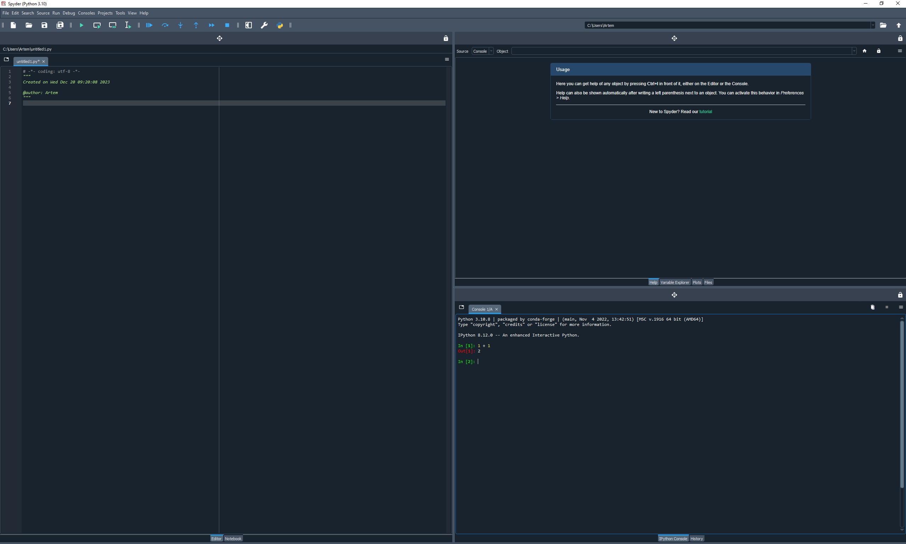

# Spyder interface

Spyder has a handy interface, which allows you to:
1. Edit your code with syntax highlighting (the pane on the left)
2. Run your code interactively (iPyhon console on the bottom right)
3. Multipurpose console on the top right, allowing you to
    - get help on a function
    - look up active variables in your workspace and directly view their values (if possible)
    - look at the files located in your directory




If you are sentimental and miss your Matlab (or RStudio) interface, you can go to *View* >> *Window layouts* >> Matlab layout


# A few important aspects
Spyder is highly flexible and the only way to learn it is to start using it. Here are a few things to pay attention to right away:
1. On the top right you can see the ```Working directory``` (e.g. C:\Users\Artem). Spyder assumes that your program is located there. Spyder usually changes the working directory automatically based on the file your are running from. However, many errors happen when you are trying to run a file which is not in your working directory and it is good thing to check first.
2. At the bottom right, note your environment name and the version of python you are using (e.g. conda: default (Python 3.10.8))
3. Probably the most common *Menu* that you will use is *Tools* >> *Preferences*. Here you can modify almost every aspect of *Spyder*. What you might do right away is
    - change a theme for your syntax highlighting. You can do that in *Appearance*. 
    - determine whether your plots are displayed in *Console* or in separate windows. Go to *IPython console* >> *Graphics* and under *Graphics Backend* choose either *Inline* or *Automatic*.
4. To run your program, just type it in the *Editor* (e.g. ```print('Hello Spyder')```) and press *F5*. You should see the output appearing in the console. It is also useful to run a subset of the code. To do that highlight the code you want to run and press *F9*.

